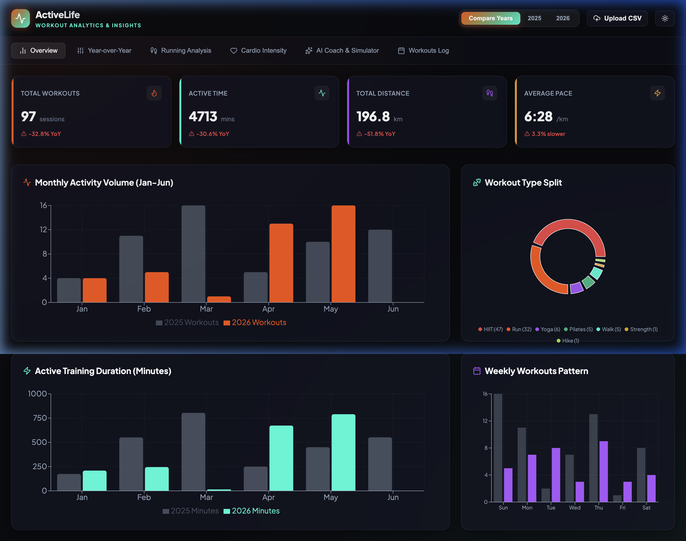
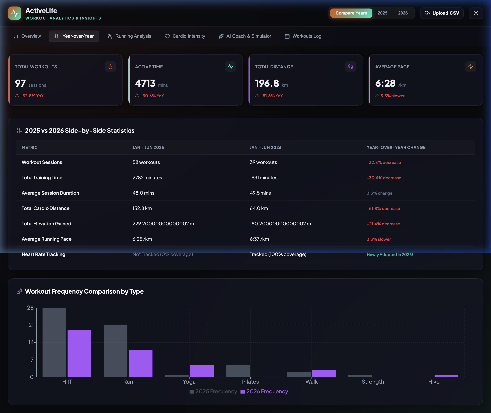
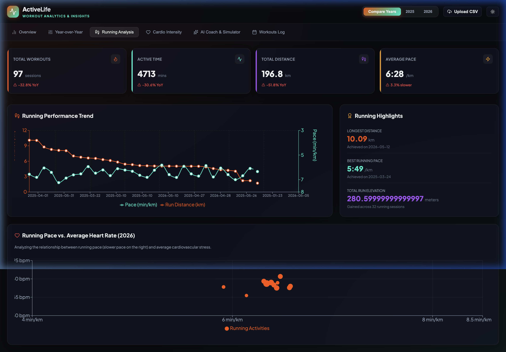
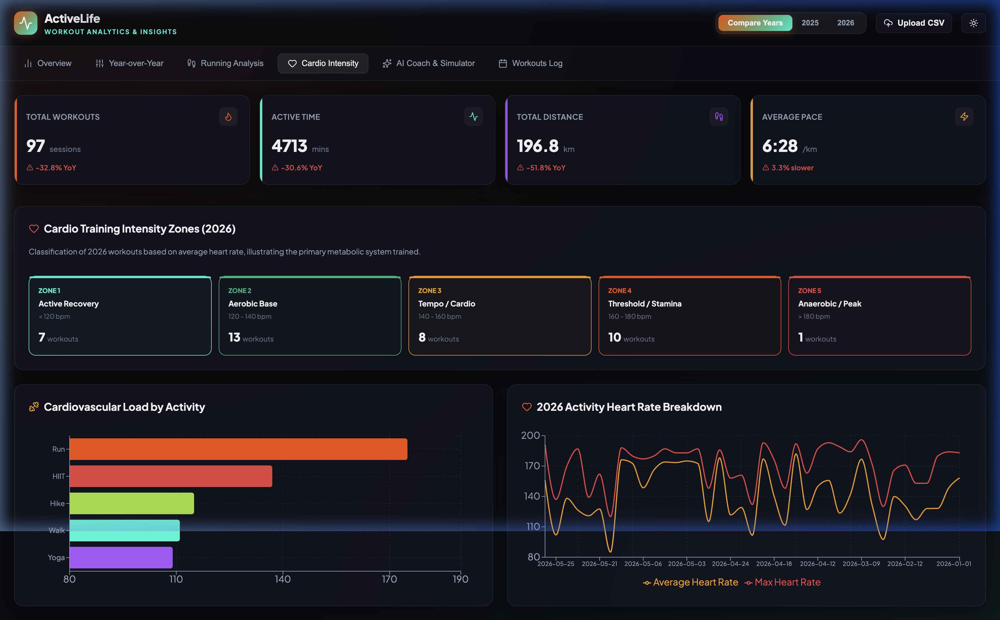
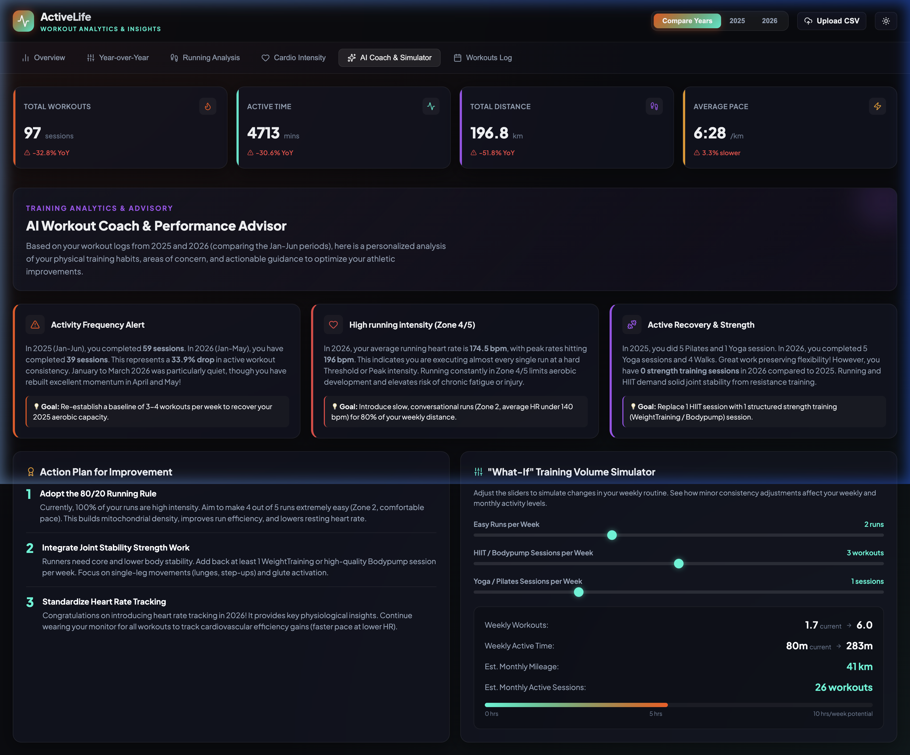

# ActiveLife // Workout Analytics & Strava MCP Server

ActiveLife is a comprehensive personal training suite designed to analyze and optimize your fitness activities. It features two core components:

1. 🔌 **Strava Model Context Protocol (MCP) Server:** A Python-based server that bridges your live Strava account with local LLMs (like Claude Desktop or Gemini), giving your AI assistant direct tool access to your activities, cardiovascular streams, and athlete profile.
2. 📊 **Interactive Workout Dashboard:** A high-fidelity, client-side React (Vite + TypeScript) application to visualize, compare, and simulate your fitness metrics (Jan-Jun 2025 vs 2026).

---


## 📋 Prerequisites

Before you begin, ensure you have the following installed:
- **Node.js** (v18 or higher) for the React Dashboard
- **Python** (v3.8 or higher) for the MCP Server
- **Git**

---

## 🔌 1. Strava MCP Server (Python & FastMCP)

The MCP server connects your live Strava data directly to your AI assistant. It exposes a series of tools that allow LLMs to query athlete details, list recent activities, retrieve individual activity profiles, and fetch detailed time-series stream data.

### 🔑 Step 1: Create a Strava API Application
You need a free Strava developer application to interact with their API:
1. Go to **[strava.com/settings/api](https://www.strava.com/settings/api)** and log in.
2. Click **Create an App**.
3. Fill out the application form:
   * **Application Name:** Anything you want (e.g., `ActiveLife AI`)
   * **Category:** Choose any
   * **Website:** `http://localhost`
   * **Authorization Callback Domain:** `localhost`
4. Copy your **Client ID** and **Client Secret**.

### ⚙️ Step 2: Configure Environment Variables
Inside the `mcp_server/` directory, copy the example environment file and fill in your copied credentials:

```bash
# Navigate to the server folder
cd mcp_server

# Copy the environment file template
cp .env.example .env
```
Open `.env` and fill in `STRAVA_CLIENT_ID` and `STRAVA_CLIENT_SECRET`.

### 🔓 Step 3: Run the Authenticator
Run the interactive Python OAuth flow to authorize the application. This script spins up a temporary callback server, opens a browser window to Strava, and safely saves authorization tokens locally in `strava_tokens.json`.

We recommend using a Python virtual environment to isolate dependencies:

```bash
# Create and activate a virtual environment
python3 -m venv .venv
source .venv/bin/activate  # On Windows, use: .venv\Scripts\activate

# Install Python dependencies
pip install -r requirements.txt

# Run the authenticator
python3 auth.py
```
*Follow the browser instructions to authorize the app, then return to your terminal.*

### 🛠️ Step 4: Add to your LLM Client (Claude Desktop / Gemini)
To connect the MCP server, add it to your client's configuration file.

* **Claude Desktop Configuration Path:**
  * Mac: `~/Library/Application Support/Claude/claude_desktop_config.json`
  * Windows: `%APPDATA%\Claude\claude_desktop_config.json`

Add the following config configuration (update the absolute script path to match your machine):

```json
{
  "mcpServers": {
    "strava": {
      "command": "python3",
      "args": [
        "/ABSOLUTE/PATH/TO/workout/mcp_server/mcp_server.py"
      ]
    }
  }
}
```

### ⚡ Available MCP Tools
Once configured, your AI assistant can run these tools autonomously:
* `get_athlete_profile()`: Fetches profile info, gear, and weight.
* `list_activities(before, after, page, per_page)`: Retrieves paginated recent workouts.
* `get_activity_details(activity_id)`: Fetches precise splits, segment efforts, and map coordinates.
* `get_activity_streams(activity_id)`: Retrieves raw, second-by-second time-series sensor data (heartrate, altitude, speed).

---

## 📊 2. Web Dashboard (React & Vite)

The ActiveLife Dashboard is built as a fast, client-side application. It normalizes dates and activity types, aggregates records monthly, and presents interactive Recharts views.

### 🚀 Setup & Launch
Navigate to the `dashboard` directory, install Node dependencies, and start the development server:

```bash
# Navigate to the frontend directory
cd dashboard

# Install packages
npm install

# Start the dev server
npm run dev
```

Open **[http://localhost:5173/](http://localhost:5173/)** in your browser to view the application.

### 🌟 Features
* **Year-over-Year Comparison:** Analyze changes in total sessions, duration, distance, and run pacing between 2025 and 2026.
* **Running Analysis:** Tracks speed consistency and pace improvement across months.
* **Cardio Intensity & HR Zones:** Automatically profiles training sessions into 5 biological heart rate zones (Aerobic Base, Tempo, Threshold, Anaerobic, etc.).
* **"What-If" Training Simulator:** Plan consistency by adjusting weekly runs, HIIT, or yoga targets, with live predictions of monthly mileage and active hours.
* **Interactive CSV Dropzone:** Drag and drop your latest Strava CSV logs directly into the header to reload the metrics on the fly.

---

## 📸 Dashboard Gallery

Here is a look at the ActiveLife web interface:

### Overview Dashboard


### Year-over-Year Comparison


### Running Performance Trend


### Heart Rate Intensity Zones


### AI Coach & What-If Simulator


## 📄 License
This project is licensed under the MIT License - see the LICENSE file details.
